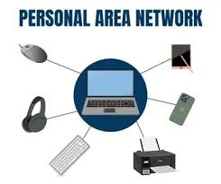
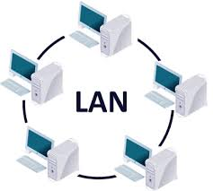
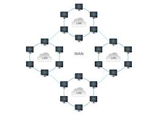
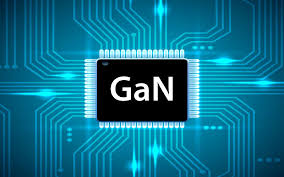

# Obunkham.github.io

 
 
<a href="indice.html"> indice  
  
   
<a href="copertina.html"> copertina 
   

<html>
<head>

</head>
<body>
  
 <title>CAPITOLO 1</title>
<h1>
paragrafo1 
<h2>
scienza 
  
<h1></h1>
L’informatica ha bisogno anche di usare la scienza.
Per esempio tutti i computer per essere costruiti
devono avere dietro un processo di progettazione e
realizzazione complesso composto da diversi codici come il "codice binario"
<h1>
paragrafo2 
<h2>
storia 
  
<h1></h1>
Negli anni la tecnologia dei computer è migliorata parecchio.

Abbiamo avuto diverse rivoluzioni industriali negli anni

La 1° rivoluzione industriale: inizia nel
XVIII secolo e vengono create le
prime macchine a vapore e nuovi
mezzi di trasporto

La 2° rivoluzione industriale: inizia nel
1870 viene scoperto il petrolio e
l’elettricità  

  

<h1></h1>
La 3° rivoluzione industriale: avviene
nel XX secolo l’uomo riesce ad
andare nello spazio e scopre
l’energia a fonte rinnovabile

La 4° rivoluzione industriale: l’
invenzione del AI o IA la stampante
3D
<h1>
paragrafo3 
<h2>
aspetti-positivi/negativi 
  
<h2>

ASPETTI POSITIVI:  

<h1></h1>
L’internet può aiutare con informazioni utili

Può essere una forma di intrattenimento

Messaggiare a lunghe distanze

<h2>
ASPETTI NEGATIVI 

<h1></h1>
Le dipendenze che si possono formare con l’uso eccessivo della
tecnologia

Il cyber bullismo

I problemi di privacy

Fake news/scam  

capitolo 2 
<h1>
paragrafo4 
<h2>
come comportarsi in rete  
  
<h1></h1>
In rete si deve fare attenzione a quello che si pubblica nei
social media (immagini,video,foto,commenti) e anche a non
cadere per gli scam

paragrafo5
<h2>
componenti-hardware/software  
  
<h1></h1>
Il computer è composto da più componenti tra cui memorie
come la RAM-ROM-CACHE.  

<h1></h1>
Ogni computer ha anche un sistema operativo diverso
es:Ubuntu,Windows,Linux ecc.
<h1>
hardwer <h1></h1>
 scheda madre     
<h1></h1>
periferiche input-output  
  
<h1></h1>
la CPU é la componente é il processore necessaria per l'elaborazione delle informazioni e dei programmi  
  
<h1></h1>
la RAM, piú é pesante il programma piú memoria ram servirá di solito é necessario solo 8 GB ma potrebbe arrivare anche fino ai 16 GB.  
  
<h1></h1>
la GPU elabora grandi gruppi di dati e informazioni e serve fondamentalmente per il 3D.  
  
<h1></h1>
la PSU serve per l'alimentazione del computer in base alle altre componenti richiederá meno o piú alimentazione.
<h1></h1>
software BIOS applicazioni sistema operativo  
  

Per usare un computer servono anche componenti esterne come
il mouse,la tastiera e un monitor.
viene azionato usando un comando che viene eseguito usando delle informazioni che vengono eseguite solo se il rpogramma 

<h1>
CAPITOLO 3  
<h1>
paragrafo6
<h2>
codifiche ASCII   
   
<h1></h1>
(American Standard Code for Information Interchange)
e collegata alla tastiera codifica dei numeri (interi e reali) con la codifica immagini e audio
<h1>
paragrafo7
<h2>
porta rj45  
  
<h1></h1>
la porta rj45 é necessaria per collegare un ruter a un pc per via cablata.
non é obbligatoria ma la differenza tra una connesione senza cavo e con é gigantesca.
<h1>
Capitolo 4
<h1>
paragrafo8 
<h2>
Occupazione di memoria immagini  
<h1></h1>
Per calcolare l'occupazione di memoria di un immagine si deve calcolare la risoluzione per esempio "580x640" e facciamo come esempio una tonalitá di grigio in Mb.  
Avendo tutte queste informazioni possiamo calcolare 580x640 X 8 per trovare le altre occupazione si deve prendere il risultato del occ1 e dividierla per 2 alla 10
<h1>
Paragrafo 9
<h2>
 Codifiche video  
<h1></h1>
 Normalmente l'occhio umano riesce a vedere 30fps=frame/fotogrammi per secondo.  
 Per trovare occ1 di un video si deve prendere:la risoluzione X la profonditá X i frame X i sceondi.  
 Per avere le altre occupazione si deve prendere l'occ1 e dividerla per 8 e il risultato continuarlo a dividere per 2 alla 10

<h1>
paragrafo10  
<h2>
la differenza tra file LOSS e LOSSLES  
<h1></h1>
Nei file LOSS per esempio nei jpeg c'é la possibilitá di perditá di informazioni nella trasmissione. 
<h1></h1>
Nei file LOSSLES per esempio nei PNG/GIF non viene persa nessuna informazione.  
<h1>
paragrafo11  
<h2>
codifiche audio
<h1></h1>
le codifiche audio sono composte dalla DISCRETIZZAZIONE,CAMPIONAMENTO,QUANTIZZAZIONE.  
 Grazie a queste tre componenti riusciamo a calcolare l'audio a causa del rumore che viene codificato in linee che in  
 un grafico vengono rappresentate come onde
 <h1>
paragrafo12
  <h2>
la differenza tra compiter General purpose e una work station
   <h1></h1>
 Nei compiter general porpose il loro scopo é generale quindi non hanno un obbiettivo specifico  
 <h1></h1>
   da compiere potrebbe essere un semplice compiuter per aprire crome fare presentazioni ecc...  
    <h1></h1>
 Le work station servono a compiere un lavoro specifico o piú pesante
    <h1>
Capitolo 5
    <h2>
cosa è una rete  
      
    <h1></h1>
 La rete sono 2 o più compiuter o altri dispositivi elettrici che permette lo scambio di dati e informazioni
    <h2>
Personal Area Network (PAN)   
     
    <h1></h1>
 La PAN è una rete personale come per esempio il tuo ruter che viene utilizzato per connettere dispositivi come compiter,telefoni,tablet ecc.
    <h2>
LAN   
     
    <h1></h1>
 La LAN serve per collegare di versi dipositivi periferici condivisi che copre un area come un'abitazione,scuola,azienda o un complesso di edifici adiacenti
    <h2>
WAN  
     
      <h1></h1>
La WAN adifferenza della PAN e della LAN ricopre un area molto più vasta come per esmpio un banca
    <h2>
GAN  
     
      <h1></h1>
La GAN serve per migliorare l'efficenza e l'esperienza delle tue ricerche 
   
   
  <a href="#scienza">scienza</a>
   
  
  <a href="#storia">storia</a>
   
  
  <a href="#aspetti-positivi-negativi">aspetti-positivi/negativi</a>
   
  
  <a href="#come-comportarsi-in-rete">come comportarsi in rete</a>
   
  
   <a href="#componenti-hardware-software">componenti hardware/software</a>
   
  
  <a href="#codifiche-ascii">codifiche ascii</a>
   

 <a href="#porta-rj45">porta rj45</a>
   

  <a href="#occupazione-di-memoria-immagini">occupazione memoria immagini</a>
   

 <a href="#codifiche-video">codifiche video</a>
   
  
<a href="#la-differenza-tra-file-loss-e-lossles">la differenza tra file LOSS e LOSSLES</a>
 

<a href="#codifiche-audio">codifiche audio</a>
   
  
<a href="#la-differenza-tra-compiter-general-purpose-e-una-work-station">la differenza tra compiter General purpose e una work station</a>
   
  
  <a href="#cosa-è-una-rete">cosa è una rete</a>
   
  
  <a href="#personal-area-network">Personal Area Network</a>
   

  <a href="#lan">LAN</a>
   

   <a href="#lan">WAN</a>
   

   <a href="#gan">GAN</a>
   
