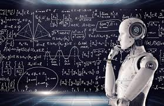

       # Obunkham.github.io
 
<a href="indice.html"> indice
   
   
<a href="copertina.html"> copertina
   

  

<h1>paragrafo1</h1>

<h1>scienza</h1>
  
L’informatica ha bisogno anche di usare la scienza.
Per esempio tutti i computer per essere costruiti
devono avere dietro un processo di progettazione e
realizzazione

<h1>paragrafo2</h1>
<h1>storia</h1>
  
Negli anni la tecnologia dei computer è migliorata parecchio.

Abbiamo avuto diverse rivoluzioni industriali negli anni

La 1° rivoluzione industriale: inizia nel
XVIII secolo e vengono create le
prime macchine a vapore e nuovi
mezzi di trasporto

La 2° rivoluzione industriale: inizia nel
1870 viene scoperto il petrolio e
l’elettricità

  

La 3° rivoluzione industriale: avviene
nel XX secolo l’uomo riesce ad
andare nello spazio e scopre
l’energia a fonte rinnovabile

La 4° rivoluzione industriale: l’
invenzione del AI o IA la stampante
3D
<h1>paragrafo3</h1>
<h1>aspetti-positivi/negativi</h1>
  
ASPETTI POSITIVI:

L’internet può aiutare con informazioni utili

Può essere una forma di intrattenimento

Messaggiare a lunghe distanze

ASPETTI NEGATIVI:

Le dipendenze che si possono formare con l’uso eccessivo della
tecnologia

Il cyber bullismo

I problemi di privacy

Fake news/scam

<h1>paragrafo4</h1>
<h1>come comportarsi in rete</h1>
In rete si deve fare attenzione a quello che si pubblica nei
social media (immagini,video,foto,commenti) e anche a non
cadere per gli scam
<h1>paragrafo5</h1>
<h1>componenti-hardware/software</h1>
  
Il computer è composto da più componenti tra cui memorie
come la RAM-ROM-CACHE.

Ogni computer ha anche un sistema operativo diverso
es:Ubuntu,Windows,Linux ecc.
<h1>hardwer</h1> scheda madre     
periferiche input-output-input e output
<h1>software</h1> BIOS applicazioni sistema operativo

Per usare un computer servono anche componenti esterne come
il mouse,la tastiera e un monitor.

<h1>CAPITOLO 3</h1>
<h1>paragrafo6</h1>
<h1>codifiche ASCII</h1>   
(American Standard Code for Information Interchange)    
e collegata alla tastiera codifica dei numeri (interi e reali) con la codifica immagini e audio
<h1>paragrafo7</h1>
<h1>porta rj45</h1>  
porte schede video scheda rj45  per internet scheda ethernet
<h1>paragrafo8</h1>
<h1>occupazione di memoria immagini</h1>

<table ALIGN="CENTER" Width="100%" border="1" bordercolorlight="#C0C0C0" bordercolordark="#808080"><tr><td  bgcolor="#E0E0E0" ALIGN=CENTER ><i>Numero di colori</i></td>
	<td  bgcolor="#E0E0E0" ALIGN=CENTER ><i>bit e byte necessari per un pixel</i></td>
	<td  bgcolor="#E0E0E0" ALIGN=CENTER ><i>byte totali per un'immagine di base B e altezza H (B e H misurati in pixel)</i></td>
	<td  bgcolor="#E0E0E0" ALIGN=CENTER ><i>Esempio: byte totali per un'immagine 800*600 pixel (schermata del monitor)</i></td></tr>

<tr><td  bgcolor="#E0E0E0" ALIGN=CENTER >2 
(solo bianco e nero, disegni <i>al tratto</i>)</td>
	<td  bgcolor="#E0E0E0" ALIGN=CENTER >1 bit = 1/8 di byte

<small>Infatti 2 elevato a 1 = 2</small></td>
	<td  bgcolor="#E0E0E0" ALIGN=CENTER >BH/8</td>
	<td  bgcolor="#E0E0E0" ALIGN=CENTER >60.000 byte</td></tr>

<tr><td  bgcolor="#E0E0E0" ALIGN=CENTER >16</td>
	<td  bgcolor="#E0E0E0" ALIGN=CENTER >4 bit = mezzo byte

<small>Infatti 2 elevato a 4 = 16</small></td>
	<td  bgcolor="#E0E0E0" ALIGN=CENTER >BH/2</td>
	<td  bgcolor="#E0E0E0" ALIGN=CENTER >240.000 byte</td></tr>

<tr><td  bgcolor="#E0E0E0" ALIGN=CENTER >256</td>
	<td  bgcolor="#E0E0E0" ALIGN=CENTER >8 bit = 1 byte

<small>Infatti 2 elevato a 8 = 256</small></td>
	<td  bgcolor="#E0E0E0" ALIGN=CENTER >BH</td>
	<td  bgcolor="#E0E0E0" ALIGN=CENTER >480.000 byte</td></tr>

<tr><td  bgcolor="#E0E0E0" ALIGN=CENTER >16 milioni</td>
	<td  bgcolor="#E0E0E0" ALIGN=CENTER >24 bit = 3 byte

Ogni pixel può assumere 256 valori PER CIASCUNO DEI TRE COLORI, quindi, per ogni colore: 256 valori = 8 bit (2 elevato a 8 = 256) = 1 byte, e dunque 1 pixel = 3 byte.</td>
	<td  bgcolor="#E0E0E0" ALIGN=CENTER >BH*3</td>
	<td  bgcolor="#E0E0E0" ALIGN=CENTER >1.440.000 byte = 1,4 MB</td></tr>  
<h1>paragrafo9</h1>
<h1>paragrafo10</h1>
<a href="#scienza">scienza</a>
   
   
  
  <a href="#storia">storia</a>
   
  
  <a href="#aspetti-positivi/negativi">aspetti-positivi/negativi</a>
   
  
  <a href="#come comportarsi in rete">come comportarsi in rete</a>
   
  
   <a href="#componenti-hardware/software">componenti-hardware/software</a>
   
 
 

